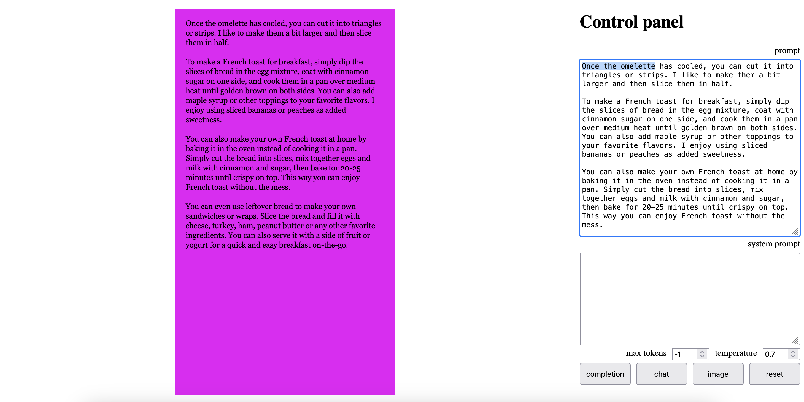
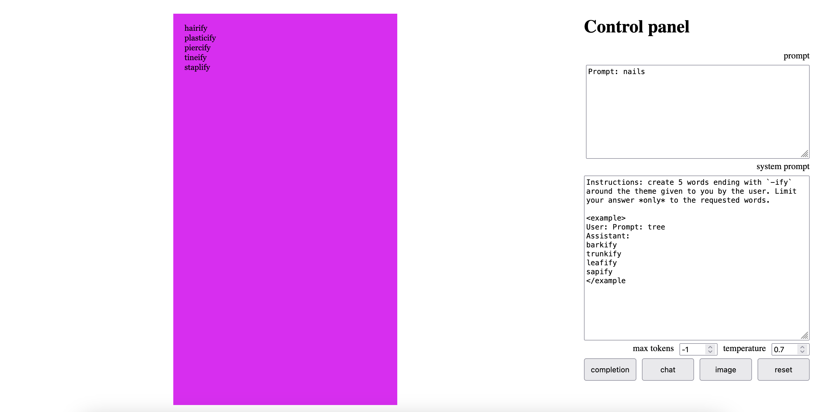
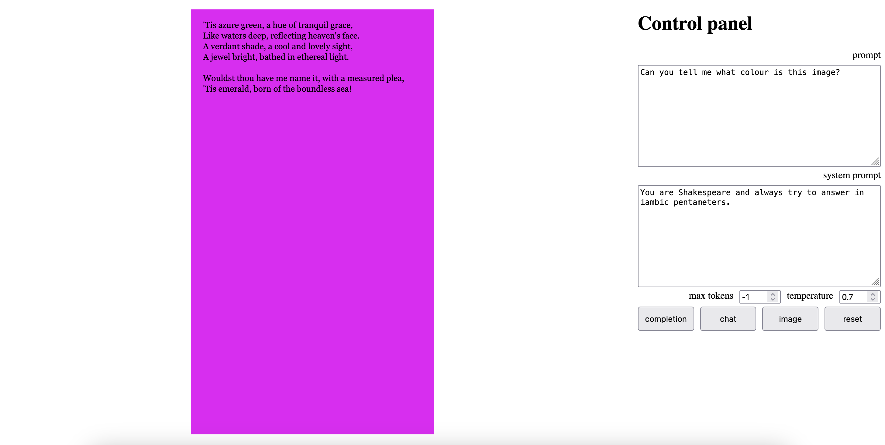

# p5.Ollama

## [p5.js](https://p5js.org/) & [Ollama](https://ollama.com/)

Originally presented during a the [Tech, Tea + Exchange Residency](https://www.tate.org.uk/whats-on/tate-modern/electric-dreams/tech-tea--exchange), London, May 2025, in a workshop with Nathan Bayliss, Robin Leverton and Jérémie Wenger. More in [this repo](https://github.com/jchwenger/TECH-TEA-EXCHANGE), then during a Computational Arts MA/MFA Workshop at Goldsmiths College, London, June 2025, by [Iris Colomb](https://iriscolomb.com/). 

## Starter code

A websocket app with with NodeJS, Express, SocketIO and P5js using the [API from Ollama](https://github.com/ollama/ollama/blob/main/docs/api.md) through [the `ollama-js` NPM module](https://github.com/ollama/ollama-js).

Note: you must have Ollama installed *and running* (the Ollama server must be running) on your machine for this to work. Also, the models must have been downloaded beforehand (using `ollama pull <model-name>` – currently, it's `llama3.2:1b` for completion/chat and `gemma3:4b` for multimodal (taking image inputs)).

Press `¬` to toggle the UI.

Click on `completion` to get your chosen model to continue the text in the **prompt** `textarea` (both the prompt `textarea` and the sketch are filled with the **prompt** and the completion). In the picture below, the original prompt is highlighted. 

Click on `chat` to get your chosen model to continue the text in the **prompt** `textarea`, while following instructions in the **system** `textarea`.

Note: giving **examples** of what you want usually helps a lot (especially for models prior to GPT-4).

Click on `image` to feed the canvas to your model, following the instructions in the **prompt** and **system** `textarea`s. This functionality could be extended to get users to upload images to the browser...

## Ideas for development

### Technical

1. Implement a chat history/interface. Notice, in [p5.Ollama/sketch.js](p5.Ollama/sketch.js) how `socket` calls `displayResponse` to inject the message into the sketch (or into the form). This could be modified in at least two ways:
  A. Currently, every new answer replaces the previous one. But perhaps instead you'd want to create a variable (an array?) that holds all previous answers, and use those to create an animation?
  B. This could be used to insert answers (and queries) into the html page, by creating a `p` or `div` somewhere on the page (inside `main`, or `ui`, use the console to study the html structure of the sketch) that contains the text. Adding more and more elements (the user's text when it's sent, then the LLM's answer) is in fact the logic behind text messaging apps like WhatsApp.
2. One thing that the current sketch also does not exploit at all is the idea of a longer history (that could be fed to the LLM alongside the last prompt). For this, what you would need to implement is a variable in `server.js` that stores all the messages (both the user's and the LLM's) as they arrive or are generated. Then, you would need to modify the code in the functions that query the LLM (`requestCompletion`, `requestChat`, `requestChatImage`) so that past messages are included in the `messages` array.
3. Modify the UI to allow users to change the model? For that, I would recommend creating a new type of socket message (both in `sketch.js` and in `server.js`). Then you can [use the API](https://github.com/ollama/ollama-js?tab=readme-ov-file#pull) to download a specific model. In the same vein, one could add a button to the UI that could display the [list of available models](https://github.com/ollama/ollama-js?tab=readme-ov-file#list).
4. Add examples to the UI. Notice how in [Huggingface apps](https://huggingface.co/spaces/Qwen/Qwen3-Demo) there are often examples given to users, that auto-fill the forms? This could be implemented in `sketch.js` by writing various prompts and parameters in an object, and use a [select tag](https://www.w3schools.com/tags/tag_select.asp).

### Artistic

1. Add textual animations: currently, the only thing that `displayResponse` does is to use `text` to write the text on the canvas. But one could imagine having some sort of text-based animation, and use the LLM response as material (the response does not necessarily have to stay as it is: one could also split on spaces to get a jumble of words, or split on letters, or try and use the content of the response to trigger animations, etc.). Of course, one could also combine textual animations with other kinds! (Idea: decompose the answer into words, and use each word as a boid/agent in some [swarm algorithm](https://thecodingtrain.com/tracks/the-nature-of-code-2/noc/5-autonomous-agents/1-steering-agents)?)
2. Use the LLM to modify the sketch: given the right prompt (using an example will help), you can ask the LLM to choose between a fixed number of possibilities by outputting only a number, or a short word (you could even add a constraint of forcing only one token to be generated). For instance, you could ask the LLM to choose between circle, square, triangle and star: once you have the response (as 1, 2, 3 or 4), you could use a `switch` or `if` statement to call the appropriate function (written by you, with or without LLM help) that will draw the appropriate animation... This could be pushed quite far! For instance, if in your prompt you tell your LLM, say, that if it wants to trigger the animation X it has to write '<|X|>' in its response, you can then parse the answer for this particular string, and then call a function that displays this animation.
3. Make the LLM more autonomous: currently, only user input will trigger generation by the LLM, but that's only a design choice. You could also imagine getting rid of all the dialogue bit, and only using a generative process to call the LLM (perhaps at regular intervals, perhaps only when a certain state of your system is reached).
4. Use more than one LLM: it might be possible (depending on your hardware/RAM) to dialogue with two LLMs instead of just one? The interesting thing in this case would be to see if one LLM can trigger the other to do something (like outputting a specific string, that itsefl calls an animation)? It could also be possible to push one LLM to formulate questions, and the other LLM to answer. This would require some fairly extensive coding, as you'd need to be able to distinguish which model you are calling, and which one is answering, at any given time.
5. Use an API (or links) to collect images from online, and use those as material to send to the multimodal LLM! One could imagine also use the webcam (or a video), and extract one frame from the video.
